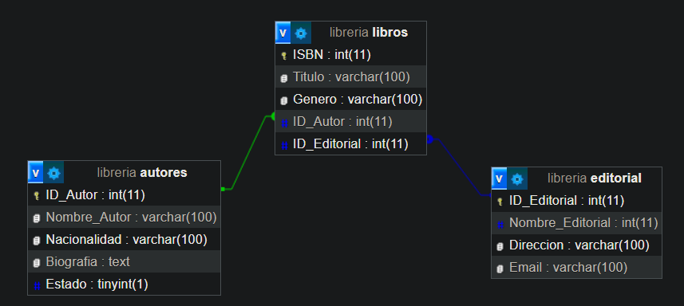

# **TP - 2**

## Integrantes:
- **Gil Eitan Steven** - EitanSteven2002@hotmail.com
- **Palavecino, Mariana Ayelen** – marianapalavecino5@gmail.com

## Observacion de los Alumnos de este TP:
- Salto muy abrupto del primer tp a este.
- Fue complicado entender como funciona el MVC, al principio parece una telaraña, pero al final logramos familiarizarnos con el, aunque tarde, por que no llegamos a hacer todas las funcionalidades a tiempo. 

## Notas:
- Este commit fue realizado el 20/10 a las 8am. Subiendo las funcionalidades de carga de libros y autores que eran las que faltaban en el comit entregado el dia de la fecha limite. 
- Segundo commit realizado el 22/10 a las 00:20hs, subiendo la funcionalidad de login y seguridad.

## Funcionalidades conseguidas:
- **Imprimir/Seleccionar libros por categoria (autor/id)**: Pagina de **home** donde se puede seleccionar un autor, y se imprimira una tabla con sus libros.
- **Update** Cambiar estados de Vivo o Muerto de los autores, y de Stock en los libros en la pagina **login(/admin)**.
- **Imprimir ambas tablas** en la seccion login (/admin).
- **Eliminar libros por ID** en la seccion login (/admin).
- **Eliminar Autores y todos sus libros** en la seccion login (/admin).
- **Cargar Autores y Libros** en la seccion login (/admin).
- **Login y Seguridad**.

## Preguntas:
- **Create de ambas tablas**: Respecto a esto tenemos una consulta, al momento de asignar la llave foranea entre las tablas de la base de datos, dejamos de poder insertar libros o autores sin tener que ingresar el Id (PK). Es decir, que debemos ingresarlo de forma manual, por lo que en el codigo luego obtenemos la longitud/cantidad de autores/libros, para obtener el ultimo ID y sumarle +1 para insertar uno nuevo ¿Esto es correcto? ¿Debe funcionar asi o el hecho de que el PK no aumente automaticamente es un error de configuracion?
- Actualizacion: Creemos que es por que en la database, pusimos primary en vez de AI (Auto Increment), creiamos que era lo mismo.

## Temática: Librería y Autores

La temática elegida tiene como propósito establecer una categorización de libros para una pequeña tienda, con el fin de agilizar y mejorar la búsqueda de estos, al mismo tiempo que facilita el seguimiento de su inventario, reemplazando un proceso previo basado únicamente en registros en papel.

### **A continuación, definiríamos las relaciones entre estas entidades:**

- Un Autor puede escribir varios libros. Esto presenta una relación de "uno a muchos" (1-N).

